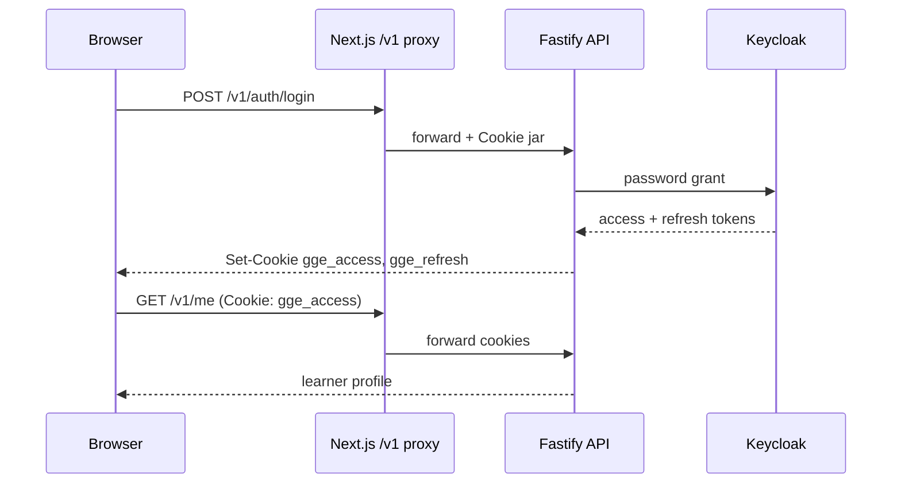

# Auth cookies and sessions

How German Got Easy keeps learners signed in on the hosted web app.

## Flow

1. Learner submits email/username + password on `/login` or `/register`.
2. Next.js proxies `POST /v1/auth/*` to the Fastify API (same origin; cookies stay first-party).
3. The API talks to **Keycloak** (password grant + Admin API for registration). See [keycloak.md](./keycloak.md).
4. On success the API sets httpOnly cookies (never returns access tokens to JavaScript for normal UI use).
5. Protected routes read `gge_access`. When it expires, the frontend calls `POST /v1/auth/refresh`, which reads `gge_refresh` and rotates cookies.

## Cookies

Source of truth: `backend/src/lib/cookies.ts`. Public inventory: Privacy Policy cookie table.

| Name | Path | httpOnly | Purpose |
| --- | --- | --- | --- |
| `gge_access` | `/` | yes | Short-lived access JWT for API calls |
| `gge_refresh` | `/v1/auth` | yes | Refresh token; only sent to auth routes |

Flags:

- `Secure` follows `COOKIE_SECURE` (`true` on HTTPS production).
- `SameSite` follows `COOKIE_SAME_SITE` (default `lax`).
- `SameSite=none` requires `COOKIE_SECURE=true`.

There are **no** advertising or analytics cookies. Theme preference uses browser `localStorage` key `theme` (`next-themes`), not a cookie.

## Related env

| Variable | Role |
| --- | --- |
| `CORS_ORIGIN` | Public web origin(s); credentials must match |
| `COOKIE_SECURE` | Must be `true` behind TLS |
| `COOKIE_SAME_SITE` | Usually `lax` for same-origin web |

## Key code

| Area | Location |
| --- | --- |
| Cookie helpers | `backend/src/lib/cookies.ts` |
| Auth routes | `backend/src/routes/auth.ts` |
| Auth plugin | `backend/src/plugins/auth.ts` |
| Browser API helper | `frontend/src/lib/api.ts` |
| Same-origin proxy | `frontend/src/app/v1/[...path]/route.ts` |
| Public legal inventory | `frontend/src/lib/legal.ts` → `AUTH_COOKIES` |
